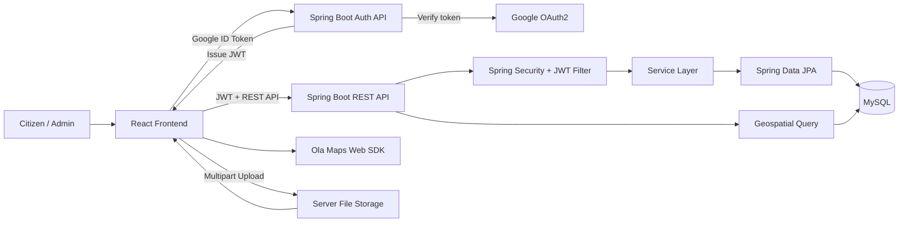
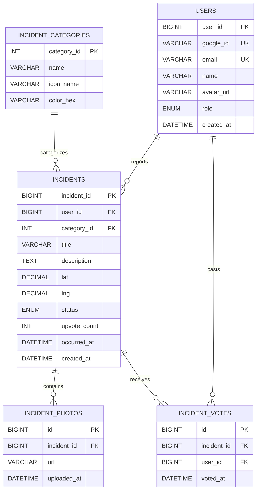
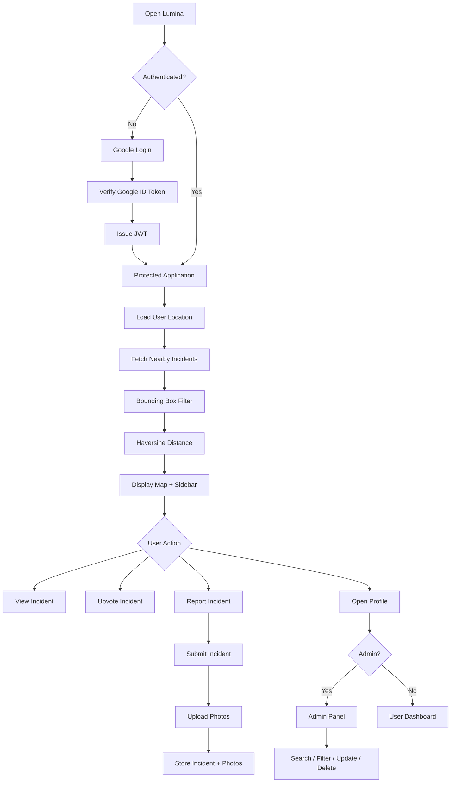

# Lumina — Smart City Safety Mapper

> A full-stack civic safety platform that helps citizens **discover, report, and track local safety incidents** through an interactive map, authenticated user accounts, and an administration dashboard.

**Frontend:** React 18 + Vite  
**Backend:** Spring Boot 3 + Spring Security + JPA  
**Database:** MySQL  
**Maps:** Ola Maps Web SDK  
**Authentication:** Google OAuth2 + JWT

---

## 📌 Table of Contents

- [Overview](#-overview)
- [Core Features](#-core-features)
- [System Architecture](#-system-architecture)
- [Tech Stack](#-tech-stack)
- [Project Structure](#-project-structure)
- [Database Design](#-database-design)
- [REST API](#-rest-api)
- [Authentication & Authorization](#-authentication--authorization)
- [Key Technical Decisions](#-key-technical-decisions)
- [Environment Variables](#-environment-variables)
- [Getting Started](#-getting-started)
- [Development Workflow](#-development-workflow)
- [Implementation Timeline](#-implementation-timeline)

---

## 🎯 Overview

Lumina is designed around a simple workflow:

**Locate → Discover → Report → Track → Manage**

Users can:

- View nearby safety incidents on an interactive map.
- Filter incidents by category and search radius.
- Open detailed incident information, photos, reporter details, and location.
- Report new incidents with descriptions, coordinates, and photos.
- Upvote incidents.
- Manage their own reports from a personal dashboard.

Administrators can additionally:

- View all reported incidents.
- Search and filter incidents.
- Update incident status.
- Delete incidents.
- Monitor incident statistics.

---

## ✨ Core Features

### 🔐 Authentication & Authorization

- Google sign-in using `@react-oauth/google`.
- Frontend receives a Google ID token and sends it to the backend.
- Backend verifies the ID token with Google.
- Backend creates/finds the user and issues its own JWT.
- JWT is stored in `localStorage`.
- Axios automatically attaches the JWT to protected requests.
- Protected routes redirect unauthenticated users to login.
- Role-based access for `USER` and `ADMIN`.
- Authorization enforced at both frontend and backend levels.
- Session restoration after page refresh.
- Logout clears the local session.

### 🗺️ Interactive Safety Map

- Ola Maps Web SDK with vector tiles.
- Browser geolocation to center the map around the user's location.
- Incident markers displayed as colored dots.
- Marker colors correspond to incident categories.
- Custom marker popups containing:
  - Incident title
  - Category
  - Reporter
  - Time ago
  - Distance
  - Upvote action
  - Details link
- Category-based visibility filters.
- Configurable radius from **1–20 km**.
- **500 ms debounce** on radius changes.
- Nearby-incidents sidebar sorted by distance.
- Clicking a sidebar incident pans the map and opens its popup.
- Marker references are keyed by `incidentId` for efficient updates.

### 🚨 Incident Management

- Retrieve nearby incidents using latitude, longitude, and radius.
- Two-step geographic filtering:
  1. SQL bounding-box pre-filter.
  2. Precise Haversine distance calculation.
- Incident detail page with:
  - Complete incident information
  - Photo gallery
  - Mini map
  - Reporter card
  - Upvote status
- Optimistic upvote updates with rollback on API failure.
- Backend tracks whether the current user has already voted.
- Incident reporting form with:
  - Category
  - Title
  - Description
  - Date/time
  - Latitude/longitude
  - Up to 3 photos
- "Use my current location" automatically fills coordinates.
- Multipart photo upload.
- Local filesystem photo storage.
- Photo preview and individual removal before submission.

### 👤 User Dashboard

Route: `/profile`

- Google profile avatar.
- Name, email, and role.
- Statistics:
  - Total reports
  - Total upvotes received
  - Resolved incidents
- "My Reports" list.
- Incident status badges.
- Delete-own-incident functionality.
- Separate admin deletion endpoint.
- Logout.

### 🛠️ Admin Panel

Route: `/admin`

- Paginated incident table.
- 10 incidents per page.
- Dashboard statistics:
  - Total
  - Active
  - Resolved
  - Flagged
- Inline status updates:
  - `ACTIVE`
  - `RESOLVED`
  - `FLAGGED`
- Incident deletion with confirmation.
- Client-side title search.
- Status filtering.
- Previous/next and numbered pagination.
- Admin-only access enforced on both frontend and backend.

### 🧭 Navigation & UX

- Persistent navbar on protected pages.
- Active navigation highlighting with `NavLink`.
- Admin navigation shown only to administrators.
- Avatar dropdown containing profile and logout actions.
- Bootstrap responsive navigation.
- Dedicated `404 Not Found` page.
- Dedicated `403 Forbidden` page for unauthorized access.

---

## 🏗️ System Architecture



### High-Level Request Flow

```text
User
  │
  ▼
React UI
  │
  ├── Google Login ───────────────► /auth/google
  │                                  │
  │                                  ▼
  │                           Google ID Token Verification
  │                                  │
  │                                  ▼
  │                                JWT
  │
  └── Protected API Requests ─────► Spring Security
                                      │
                                      ▼
                                  Controller
                                      │
                                      ▼
                                   Service
                                      │
                         ┌────────────┴────────────┐
                         ▼                         ▼
                    MySQL / JPA              File Storage
```

---

## 🧰 Tech Stack

### Frontend

| Technology | Purpose |
|---|---|
| React 18 | UI development |
| Vite | Frontend build tooling |
| React Router DOM | Client-side routing |
| Ola Maps Web SDK | Interactive map and markers |
| Bootstrap 5 | Responsive UI and components |
| Axios | REST API communication |
| Sonner | Toast notifications |
| `@react-oauth/google` | Google sign-in |

### Backend

| Technology | Purpose |
|---|---|
| Spring Boot 3 | Backend application framework |
| Spring Security | Authentication and authorization |
| JWT | Stateless authentication |
| Spring Data JPA | Persistence layer |
| MapStruct | DTO/entity mapping |
| Lombok | Boilerplate reduction |
| Google API Client | Google ID-token verification |
| MySQL | Relational database |

### Supporting Components

| Component | Purpose |
|---|---|
| Browser Geolocation API | Current user location |
| Local filesystem | Incident photo storage |
| Haversine formula | Precise geographic distance |
| Multipart/form-data | Photo upload |

---

## 📁 Project Structure

### Backend

```text
Backend/
├── controller/
│   ├── AuthController.java
│   ├── IncidentController.java
│   ├── UserController.java
│   └── AdminController.java
│
├── service/
│   ├── GoogleAuthService.java
│   ├── IncidentService.java
│   ├── IncidentPhotoService.java
│   ├── UserService.java
│   ├── AdminService.java
│   └── FileStorageService.java
│
├── model/
│   ├── User.java
│   ├── Incident.java
│   ├── IncidentCategory.java
│   ├── IncidentPhoto.java
│   └── IncidentVote.java
│
├── dto/
│   ├── AuthResponseDto.java
│   ├── GoogleAuthRequestDto.java
│   ├── IncidentDto.java
│   ├── IncidentRequestDto.java
│   ├── IncidentCategoryDto.java
│   ├── UserDto.java
│   ├── UserSummaryDto.java
│   ├── VoteResponseDto.java
│   └── StatusUpdateDto.java
│
├── mapper/
│   ├── IncidentMapper.java
│   ├── IncidentCategoryMapper.java
│   └── UserMapper.java
│
├── repo/
│   ├── UserRepo.java
│   ├── IncidentRepo.java
│   ├── IncidentCategoryRepo.java
│   ├── IncidentPhotoRepo.java
│   └── IncidentVoteRepo.java
│
├── security/
│   ├── JwtUtil.java
│   ├── JwtAuthFilter.java
│   ├── SecurityConfig.java
│   └── GoogleAuthConfig.java
│
├── exception/
│   ├── GlobalExceptionHandler.java
│   ├── GoogleAuthException.java
│   ├── BadCredentialsException.java
│   └── IncidentNotFoundException.java
│
└── config/
    └── WebConfig.java
```

### Frontend

```text
Frontend/
├── api/
│   └── axiosInstance.js
│
├── components/
│   ├── LoginPage.jsx
│   ├── MapPage.jsx
│   ├── ReportPage.jsx
│   ├── IncidentDetailPage.jsx
│   ├── UserProfile.jsx
│   ├── AdminPanel.jsx
│   ├── Navbar.jsx
│   ├── ProtectedRoute.jsx
│   ├── AdminRoute.jsx
│   ├── Forbidden.jsx
│   ├── CategoryFilter.jsx
│   ├── IncidentSidebar.jsx
│   ├── RadiusSlider.jsx
│   ├── PhotoGallery.jsx
│   ├── ReporterCard.jsx
│   └── MiniMap.jsx
│
├── contexts/
│   ├── AuthProvider.jsx
│   └── CategoriesProvider.jsx
│
└── utils/
    ├── timeAgo.js
    ├── buildIncidentPopup.js
    ├── getStatusBadge.js
    └── getPhotoThumbnails.js
```

---

## 🗄️ Database Design

### Entity Relationship Overview



### `users`

| Column | Type | Notes |
|---|---|---|
| `user_id` | BIGINT PK | Auto-generated |
| `google_id` | VARCHAR | Unique Google `sub` claim |
| `email` | VARCHAR | Unique |
| `name` | VARCHAR | User name |
| `avatar_url` | VARCHAR | Google profile picture |
| `role` | ENUM | `USER`, `ADMIN` |
| `created_at` | DATETIME | Account creation time |

### `incident_categories`

| Column | Type | Notes |
|---|---|---|
| `category_id` | INT PK | Auto-generated |
| `name` | VARCHAR | Example: Fire, Road Hazard |
| `icon_name` | VARCHAR | Material symbol or emoji |
| `color_hex` | VARCHAR | Marker color |

### `incidents`

| Column | Type | Notes |
|---|---|---|
| `incident_id` | BIGINT PK | Auto-generated |
| `user_id` | BIGINT FK | References `users` |
| `category_id` | INT FK | References `incident_categories` |
| `title` | VARCHAR | Incident title |
| `description` | TEXT | Incident details |
| `lat` | DECIMAL(10,7) | Latitude |
| `lng` | DECIMAL(10,7) | Longitude |
| `status` | ENUM | `ACTIVE`, `RESOLVED`, `FLAGGED` |
| `upvote_count` | INT | Defaults to 0 |
| `occurred_at` | DATETIME | Incident occurrence |
| `created_at` | DATETIME | Record creation |

### `incident_photos`

| Column | Type | Notes |
|---|---|---|
| `id` | BIGINT PK | Auto-generated |
| `incident_id` | BIGINT FK | References `incidents` |
| `url` | VARCHAR | Relative upload path |
| `uploaded_at` | DATETIME | Upload time |

### `incident_votes`

| Column | Type | Notes |
|---|---|---|
| `id` | BIGINT PK | Auto-generated |
| `incident_id` | BIGINT FK | References `incidents` |
| `user_id` | BIGINT FK | References `users` |
| `voted_at` | DATETIME | Vote time |

> **Constraint:** `(incident_id, user_id)` is unique, preventing duplicate votes by the same user on the same incident.

---

## 🌐 REST API

### Authentication

| Method | Endpoint | Access | Description |
|---|---|---|---|
| `POST` | `/auth/google` | Public | Verify Google ID token and issue JWT |

### Incidents

| Method | Endpoint | Access | Description |
|---|---|---|---|
| `GET` | `/api/incidents` | User | Fetch nearby incidents |
| `GET` | `/api/incidents/{id}` | User | Fetch incident details |
| `GET` | `/api/incidents/categories` | User | Fetch incident categories |
| `POST` | `/api/incidents` | User | Report an incident |
| `POST` | `/api/incidents/{id}/photos` | User | Upload photos |
| `PUT` | `/api/incidents/{id}/vote` | User | Toggle upvote |
| `PUT` | `/api/incidents/{id}/status` | Admin | Change incident status |
| `DELETE` | `/api/incidents/{id}` | Admin | Delete an incident |

### Users

| Method | Endpoint | Access | Description |
|---|---|---|---|
| `GET` | `/api/users/me` | User | Fetch current profile |
| `GET` | `/api/users/me/incidents` | User | Fetch current user's incidents |
| `DELETE` | `/api/users/me/incidents/{id}` | User | Delete own incident |

### Admin

| Method | Endpoint | Access | Description |
|---|---|---|---|
| `GET` | `/api/admin/incidents` | Admin | Fetch paginated incidents |
| `GET` | `/api/admin/stats` | Admin | Fetch counts by status |

---

## 🔐 Authentication & Authorization

Lumina uses **two authentication steps**:

```text
Google Sign-In
     │
     ▼
Google ID Token
     │
     ▼
POST /auth/google
     │
     ▼
Backend verifies token with Google
     │
     ├── Find existing user
     └── Create user if needed
     │
     ▼
Backend issues JWT
     │
     ▼
Frontend stores JWT
     │
     ▼
Axios interceptor attaches JWT
     │
     ▼
JwtAuthFilter validates token
     │
     ▼
Spring Security sets authenticated principal
```

### Role-Based Access

Two application roles are supported:

- `USER`
- `ADMIN`

Authorization is enforced at two levels:

**Frontend**
- `ProtectedRoute`
- `AdminRoute`

**Backend**
- Spring Security configuration
- `@PreAuthorize("hasRole('ADMIN')")`

---

## 🧠 Key Technical Decisions

### 1. Google OAuth2 — Frontend-Driven Pattern

React handles the Google sign-in popup and receives the Google ID token.

The token is sent to:

```text
POST /auth/google
```

The backend verifies it with `GoogleIdTokenVerifier`, finds or creates the user, and issues Lumina's own JWT.

After authentication, Google is not involved in normal application API requests.

### 2. JWT — Stateless Authentication

Lumina does not maintain server-side sessions.

The JWT contains:

- Email
- User ID
- Role

`JwtAuthFilter` validates the token on protected requests and sets the authenticated principal in Spring Security.

This allows the application to authenticate requests without a server-side session lookup.

### 3. Haversine-Based Nearby Incident Search

Nearby incidents are retrieved using a two-stage strategy:

```text
User Location
     │
     ▼
SQL Bounding Box
     │
     │  Cheap first-stage filtering
     ▼
Candidate Incidents
     │
     ▼
Haversine Distance
     │
     │  Precise distance calculation
     ▼
Sorted Nearby Results
```

The bounding box reduces the number of rows that require precise distance calculations.

The returned `distanceKm` value is then exposed to the frontend through `IncidentDto`.

### 4. MapStruct for DTO Mapping

MapStruct generates mapper implementations at compile time.

It handles:

- Entity → DTO conversion
- Nested user/category mapping
- Photo URL extraction

Fields such as:

- `distanceKm`
- `userHasVoted`

are populated later in the service layer because they depend on runtime calculations or additional data.

### 5. Protected `CategoriesProvider`

`CategoriesProvider` is mounted inside the protected application layout.

This prevents the categories request from firing on the login page before a JWT exists.

Previously, loading the provider globally caused:

```text
Login Page
   ↓
GET /api/incidents/categories
   ↓
401 Unauthorized
   ↓
Axios interceptor redirects to /login
   ↓
Login page reload loop
```

Moving the provider into the protected layout ensures the API call occurs only after authentication is established.

### 6. Optimistic Upvotes

When a user clicks upvote:

```text
Click
  ↓
Update UI immediately
  ↓
Send API request
  ├── Success → keep server response
  └── Failure → restore previous state + show error
```

This makes the interaction feel immediate while still preserving consistency when the request fails.

### 7. Local Filesystem Photo Storage

Uploaded photos are stored in the server's `uploads/` directory.

Files use UUID-prefixed names to reduce:

- Filename collisions
- Unsafe path manipulation

Spring exposes `/uploads/**` as static resources so uploaded photos can be displayed by the frontend.

---

## ⚙️ Environment Variables

### Backend — `application.properties`

```properties
spring.datasource.url=jdbc:mysql://localhost:3306/lumina_db
spring.datasource.username=your_username
spring.datasource.password=your_password

jwt.secret=your_base64_encoded_secret_min_32_chars
jwt.expiration=3600000

google.client.id=your_google_client_id.apps.googleusercontent.com

file.upload-dir=uploads

spring.servlet.multipart.max-file-size=5MB
spring.servlet.multipart.max-request-size=20MB
```

### Frontend — `.env`

```env
VITE_OLA_MAPS_API_KEY=your_ola_maps_api_key
VITE_GOOGLE_CLIENT_ID=your_google_client_id.apps.googleusercontent.com
VITE_API_BASE_URL=http://localhost:8080
```

> Keep secrets and API credentials out of source control. Add the relevant environment files to `.gitignore`.

---

## 🚀 Getting Started

### Prerequisites

Make sure the following are installed:

- **Java 21**
- **Node.js 18+**
- **MySQL 8+**
- **Maven**

### 1. Clone the Repository

```bash
git clone <repository-url>
cd <project-directory>
```

### 2. Create the Database

```sql
CREATE DATABASE lumina_db;
```

### 3. Configure the Backend

Update `application.properties` with:

- MySQL credentials
- JWT secret
- Google client ID
- Upload directory
- Multipart limits

### 4. Start the Backend

```bash
./mvnw spring-boot:run
```

### 5. Configure the Frontend

Create a `.env` file and add:

```env
VITE_OLA_MAPS_API_KEY=your_ola_maps_api_key
VITE_GOOGLE_CLIENT_ID=your_google_client_id.apps.googleusercontent.com
VITE_API_BASE_URL=http://localhost:8080
```

### 6. Install Dependencies

```bash
npm install
```

### 7. Start the Frontend

```bash
npm run dev
```

### 8. Open the Application

```text
http://localhost:5173
```

---

## 🧪 First Run

1. Open the application.
2. Sign in with your Google account.
3. Allow browser location access.
4. To promote a user to `ADMIN`, run:

```sql
UPDATE users
SET role = 'ADMIN'
WHERE email = 'your@email.com';
```

5. Log out and sign in again so the updated role is reflected in the new JWT.

---

## 🗺️ Application Workflow



---

## 📅 Implementation Timeline

| Day | Milestone |
|---:|---|
| 1 | Project scaffolding — Spring Boot, React, MySQL |
| 2 | Database schema — 5 core tables |
| 3 | JPA entities and repositories |
| 4 | Haversine query, DTOs, MapStruct |
| 5 | Spring Security, JWT filter, security configuration |
| 6 | Google OAuth2 and Ola Maps setup |
| 7 | `/auth/google`, GoogleAuthService, exception handling |
| 8 | React authentication, login page, Axios interceptor |
| 9 | Protected routes and user profile |
| 10 | Role-based authorization and admin routing |
| 11 | Incident read APIs |
| 12 | Incident write APIs |
| 13 | Photo upload and file serving |
| 14 | Map integration and geolocation |
| 15 | Incident popups and map interactions |
| 16 | Filters, radius slider, sidebar, marker management |
| 17 | Incident report form and photo preview |
| 18 | Incident detail page and optimistic voting |
| 19 | User dashboard |
| 20 | Admin panel |
| 21 | Navbar, routing cleanup, protected layout, 404 page |

---

## 📌 Project Summary

| Area | Implementation |
|---|---|
| Frontend | React 18 + Vite |
| Backend | Spring Boot 3 |
| Authentication | Google OAuth2 + JWT |
| Authorization | `USER` / `ADMIN` |
| Database | MySQL |
| Persistence | Spring Data JPA |
| DTO Mapping | MapStruct |
| Map | Ola Maps Web SDK |
| Geolocation | Browser Geolocation API |
| Nearby Search | Bounding Box + Haversine |
| Photo Storage | Local filesystem |
| Toast | Sonner |
| Routing | React Router DOM |

---

## 🔭 Current Scope

The current implementation covers:

- Authentication
- Role-based authorization
- Interactive incident map
- Geolocation
- Nearby incident search
- Incident reporting
- Photo uploads
- Upvoting
- User dashboard
- Admin dashboard
- Incident status management
- REST APIs
- MySQL persistence

